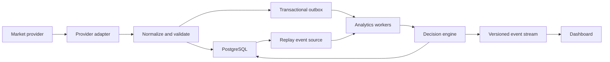
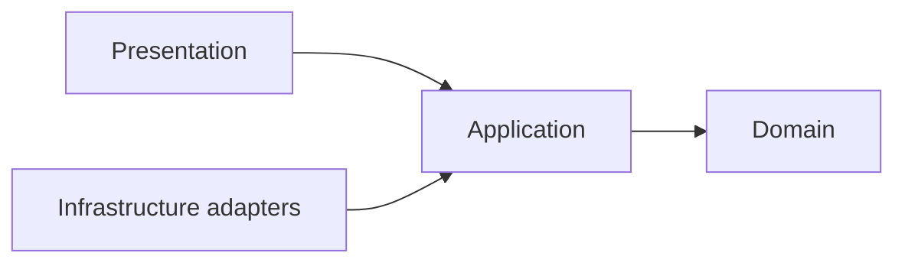

# Architecture Diagrams

## Data flow

```mermaid
flowchart LR
    P["Market provider"] --> A["Provider adapter"]
    A --> N["Normalize and validate"]
    N --> DB["PostgreSQL"]
    N --> O["Transactional outbox"]
    O --> W["Analytics workers"]
    W --> D["Decision engine"]
    D --> DB
    D --> S["Versioned event stream"]
    S --> UI["Dashboard"]
    DB --> R["Replay event source"]
    R --> W
```

## Dependency direction

```mermaid
flowchart LR
    UI["Presentation"] --> APP["Application"]
    AD["Infrastructure adapters"] --> APP
    APP --> DOM["Domain"]
```
